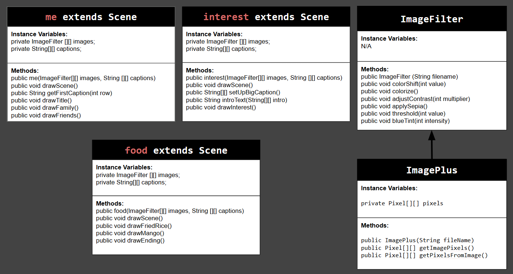
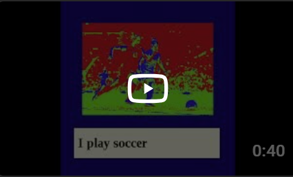

# Unit 5 - Personal Narrative / Interest Animation

## Introduction

Images are often used to portray our personal experiences and interests. We also use image filters and effects to change or enhance the mood of an image. When combined into collages and presentations, these images tell a story about who we are and what is important to us. Your goal is to create an animation using The Theater and Scene API that consists of images of your personal experiences and/or interests. In this animation, you will incorporate data related to these experiences and/or interests that can be organized in a 2D array, and use image filters and effects to change or enhance the mood of your images.
## Requirements

Use your knowledge of object-oriented programming, two-dimensional (2D) arrays, and algorithms to create your personal narrative collage or animation:
- **Write Scene subclasses** – Create two Scene subclasses: either two core parts of your personal life, or two components of a personal interest. Each class must contain a constructor and private instance variable with data related to the scene
- **Create at least two 2D arrays** – Create at least two 2D arrays to store the data that will make up your visualization.
Implement algorithms – Implement one or more algorithms that use loops and logic that operate on the data in your 2D arrays.
- **Create a visualization** – Create an animation that conveys the story of the data by illustrating the patterns or relationships in the data.
- **Image Filters** – Utilize the image filters created in this unit (and possible new filters) that show a personal flare to the images used in your animation.
- **Document your code** – Use comments to explain the purpose of the methods and code segments and note any preconditions and postconditions.

## UML Diagram

## Video

)

## Story Description

Here is a slideshow about me. About my friends, family, interest, and my favorite foods. I use photos and have captions for them. I also apply a filter to all the images so there is some fun "animation" with the pictures. For the 2D arrays, I made them of the image's names and also the corresponding caption. These relate to my story because I used 6 images so it needed the approriate 6 captions. Instead of having to call the image and write out a caption, I would just need to call the specfic element in the list to go with each other.

## Image Filter Analysis

2 filters that I used was the colorize and applying sepia to the images.

For colorize, it would take each pixel, and take the blue, green, and red color value that ranges from 1 to 255 add then together and then average it out. If the average was less than 85 then it would turn the pixel red. If the average was in between 85 and 170 then it would turn the pixel green. And then anything else would turn blue.

Then for the sepia filter, sepia is a brown. So the image would get an overall brown hue added to the image. So to each pixel, a specific amoung was multiplied with the current pixel's current red, green, and blue values. Then the new number that we got we would make sure it wasn't less than 0 or greater than 255 and then we would replace the red, green, and blue color of the the pixel with the new color that we got mathematically.
